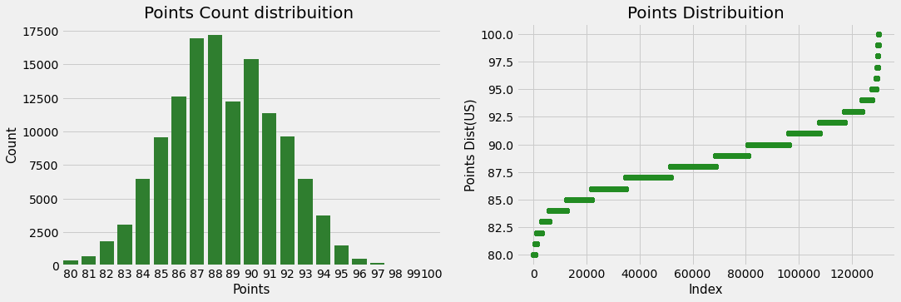
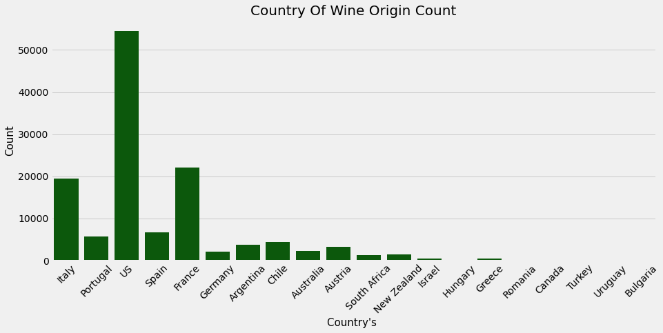
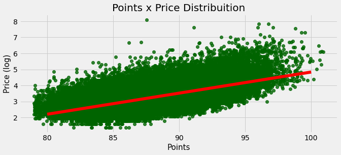
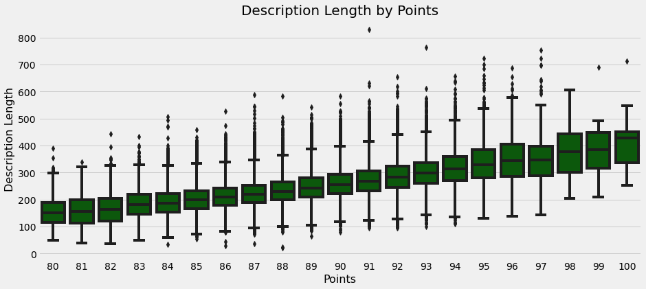

# Wine Review EDA

Exploratory data analysis of about 130,000 wine reviews. The notebook looks at how review scores (points) and prices vary by country, province, designation, grape variety, winery and taster, and how the length of a review relates to the score.

## Questions

- Do all provinces have the same number of wines?
- How are price and points distributed by province?
- Which countries are reviewed most?
- Do the tasters have the same number of reviews?
- How are points and prices distributed by taster?

## Dataset

The data is `winemag-data-130k-v2.csv` from the [Wine Reviews](https://www.kaggle.com/datasets/zynicide/wine-reviews) dataset on Kaggle (reviews published by WineEnthusiast). It has 129,971 rows and 13 columns: `country`, `description`, `designation`, `points`, `price`, `province`, `region_1`, `region_2`, `taster_name`, `taster_twitter_handle`, `title`, `variety` and `winery`.

The CSV is included in this repo compressed as `winemag-data-130k-v2.rar`.

## What the notebook covers

- A summary table of every column: data type, missing values, unique values, the first three values and entropy
- Distribution of points and price, including a log transform of price
- Outlier detection with a mean +/- 3 standard deviations rule
- Grouping points into six rating categories (80-82, 83-86, 87-89, 90-93, 94-97, 98-100)
- A regression plot of points against log price
- Counts plus price and points boxplots for the top 20 countries, provinces, designations, varieties and wineries, and for every taster
- Description length against points, taster and price

## Key findings

These come straight from the outputs in the notebook:

- Points range from 80 to 100 (mean 88.4, standard deviation 3.0) and look close to a normal distribution.
- Prices range from $4 to $3,300, with a median of $25 and a mean of $35.4. Price is missing for 8,996 wines.
- 129 wines (about 0.1%) are outliers on points, all with 98 points or more. 1,177 prices (about 1%) are outliers, all on the high side.
- Most wines fall into the 87-89 (35.7%) and 90-93 (33.0%) rating groups; only 0.1% score 98-100.
- Log price looks roughly normal and most wines cost under $100.
- Price tends to rise with points, but the most expensive wine in the data scores in the high 80s.
- The US has by far the most reviews (over 50,000), followed by France and Italy.
- The number of reviews per taster is very uneven: Roger Voss wrote over 25,000, while some tasters have only a handful.
- Among the 20 most frequent wineries, Williams Selyem and Lynmar score highest, both with a median of 93 points.
- Higher-rated wines tend to have longer descriptions.

## Charts









All charts are in the notebook, which is saved with its outputs, so it can be read on GitHub without running it.

## Tech stack

Python 3.9, Jupyter Notebook, pandas, NumPy, Matplotlib, Seaborn, SciPy

## Project structure

```
wine-review-eda.ipynb       analysis notebook (with outputs)
winemag-data-130k-v2.rar    dataset, compressed
images/                     charts exported from the notebook for this README
requirements.txt
LICENSE
```

## Running it locally

```bash
git clone https://github.com/Hamza-Tahirr/Wine-Review-EDA.git
cd Wine-Review-EDA
python -m venv venv
source venv/bin/activate        # on Windows: venv\Scripts\activate
pip install -r requirements.txt
```

Extract `winemag-data-130k-v2.rar` into the project folder with 7-Zip, WinRAR or `unrar x winemag-data-130k-v2.rar`, so that `winemag-data-130k-v2.csv` sits next to the notebook. Then start Jupyter:

```bash
jupyter notebook wine-review-eda.ipynb
```

The notebook uses `sns.distplot`, which is deprecated in newer Seaborn releases, so `requirements.txt` keeps Seaborn below 0.14.

## Credits

This notebook is adapted from Leonardo Ferreira's Kaggle notebook [Wine Review's EDA + Recommend Systems](https://www.kaggle.com/code/kabure/wine-review-s-eda-recommend-systems). The `resumetable` and `CalcOutliers` helpers and most of the analysis steps come from there. This version keeps the exploratory part, with the text cleaned up.

## License

Apache 2.0, the same license as the original Kaggle notebook. See [LICENSE](LICENSE).
